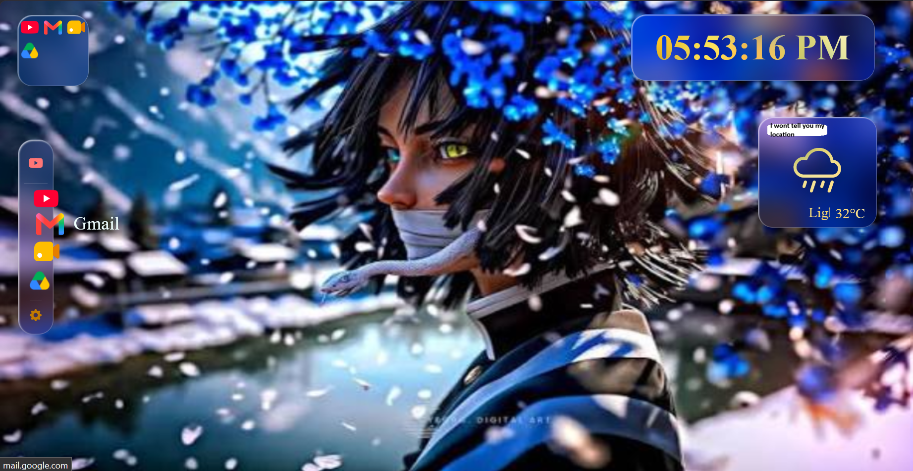

# Glass-look-homepage

A customizable, web-based desktop interface featuring glassmorphic widgets, personalized backgrounds, dynamic weather and time modals, and an interactive app launcher.

## 1. Preview

## 2. Key Features

- **Dynamic Backgrounds:** Supports custom image and video backgrounds (`mp4`, `png`, `jpg`).
- **Glassmorphic UI Widgets:** Interactive 3D cards for app shortcuts, clock display, weather metrics, and calendar.
- **Customizable Layout & Themes:** Fine-tune glass opacity, blur effects, UI scaling, text rendering modes, and bottom bar orientation.
- **Integrated Apps Launcher:** Create, edit, and organize custom app shortcuts and quick-launch items on the taskbar.

## 3. Setup & Usage
The page is available at:
<https://opsonusdh.github.io/Glass-look-homepage/>
